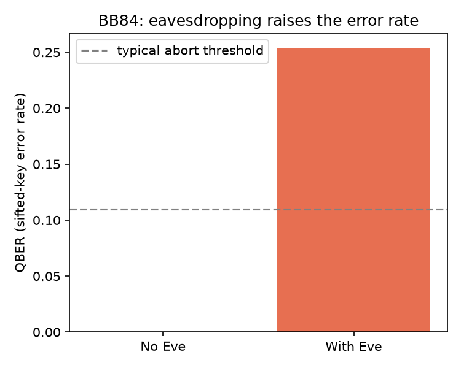

# Quantum Communication Primitives

Implementations of the three foundational quantum-communication protocols in
**Qiskit**, each with a self-checking verification so you can confirm the
physics actually works — not just that the code runs.

| Protocol | What it does | Resource trade |
|----------|--------------|----------------|
| **Quantum teleportation** | Moves an *unknown* qubit state from Alice to Bob | 1 Bell pair + 2 classical bits |
| **Superdense coding** | Sends *2 classical bits* by transmitting 1 qubit | 1 Bell pair + 1 qubit |
| **BB84 QKD** | Distributes a secret key; detects eavesdroppers | quantum channel + public sifting |

Teleportation and superdense coding are duals of each other — one trades a
shared Bell pair to send quantum information with classical bits, the other to
send classical information with a qubit. BB84 turns the same measurement-disturbance
physics into a security guarantee.

## Results

**Teleportation** — a random single-qubit state is teleported and verified by
un-preparing it on Bob's side; a perfect transfer returns his qubit to `|0>`:
```
Bob's qubit returned to |0> in 4096/4096 shots (success = 1.0000)
PASS: arbitrary state teleported with fidelity > 0.99
```

**Superdense coding** — all four 2-bit messages delivered through a single qubit:
```
message 00 -> decoded 00   message 01 -> decoded 01
message 10 -> decoded 10   message 11 -> decoded 11
PASS: 2 classical bits delivered per transmitted qubit, all messages.
```

**BB84** — with no eavesdropper the keys match exactly (QBER ≈ 0); an
intercept-resend eavesdropper is exposed by the error rate jumping to ~25%:
```
No Eve:    sifted key 303 bits, QBER 0.000, keys identical
With Eve:  sifted key 303 bits, QBER 0.254  -> attack detected
```


## Run it

```bash
pip install -r requirements.txt
python src/teleportation.py
python src/superdense_coding.py
python src/bb84_qkd.py
```

## How each protocol works

### Teleportation (`src/teleportation.py`)
1. Prepare the unknown state `|psi>` on Alice's payload qubit.
2. Share a Bell pair between Alice and Bob.
3. Alice does a Bell-basis measurement (CX, H, then measure) on her two qubits.
4. Bob applies `X` and/or `Z` corrections conditioned on Alice's two classical bits.
5. *Verification:* applying `U†` on Bob's qubit returns it to `|0>` iff teleport succeeded.

### Superdense coding (`src/superdense_coding.py`)
Alice's local gate (`I`, `X`, `Z`, or `ZX`) on her half of a Bell pair rotates it
to one of the four orthogonal Bell states; Bob distinguishes all four with a Bell
measurement, recovering both bits.

### BB84 (`src/bb84_qkd.py`)
Each bit is encoded in a random basis (Z or X). Eve cannot copy an unknown qubit
(no-cloning), so her intercept-resend guess in the wrong basis injects ~25% errors
on the sifted key — making eavesdropping statistically detectable.

## Notes
Built while studying quantum computing (CDAC / IIT Roorkee / MeitY course, 2025).
Tested on Qiskit 2.4, Python 3.12.
